<div align="center">
  <h1>Spawn</h1>
</div>

Spawn is the easiest way to build, maintain and scale a Cosmos SDK blockchain. Spawn solves all the key pain points engineers face when building new Cosmos-SDK networks.
  - **Tailor-fit**: Pick and choose modules to create a network for your needs.
  - **Commonality**: Use native Cosmos tools and standards you're already familiar with.
  - **Integrations**: Github actions and end-to-end testing are configured right from the start.
  - **Iteration**: Quickly test between your new chain and established networks like the local Cosmos-Hub devnet.

## Documentation

<https://rollchains.github.io/spawn/v0.50/>

## Installation

### Prerequisite Setup

If you do not have [`go 1.22+`](https://go.dev/doc/install), [`Docker`](https://docs.docker.com/get-docker/), or [`git`](https://git-scm.com/) installed, follow the instructions below.

* [MacOS, Windows, and Ubuntu Setup](./docs/versioned_docs/version-v0.50.x/01-setup/01-system-setup.md)

### Install Spawn

```bash
# Download the the Spawn repository
git clone https://github.com/rollchains/spawn.git --depth=1 --branch v0.50.15
cd spawn

# Install Spawn
make install

# Install Local-Interchain (testnet runner)
make get-localic

# Attempt to run a command
spawn help

# If you get "command 'spawn' not found", add to path.
# Run the following in your terminal to test
# Then add to ~/.bashrc (linux / windows) or ~/.zshrc (mac)
echo 'export PATH=$PATH:$(go env GOPATH)/bin' >> ~/.bashrc
source ~/.bashrc
```

## Build an EVM Chain

Cosmos EVM chain, CoinType 60, Full foundry support

```bash
# flags are optional
spawn new mychain --consensus=proof-of-stake --binary=simd --denom=token --disable=explorer

cd mychain

make sh-testnet

# foundry works as you expect
cast block

# cosmos works as you expect
simd status
```

## Build a Cosmos Chain

```bash
# flags are optional
spawn new mychain --consensus=proof-of-stake --binary=simd --denom=token --disable=explorer,evm

cd mychain

make sh-testnet

# cosmos works as you expect
simd status
```

## Spawn in Action

In this 4 minute demo we:
- Create a new chain, customizing the modules and genesis
- Create a new `nameservice` module
  - Add the new message structure for transactions and queries
  - Store the new data types
  - Add the application logic
  - Connect it to the command line
- Build and launch a chain locally
- Interact with the chain's nameservice logic, settings a name, and retrieving it

[Follow Along with the nameservice demo in the docs](https://rollchains.github.io/spawn/v0.50/build/name-service/) | [source](./docs/versioned_docs/version-v0.50.x/02-build-your-application/01-nameservice.md)

https://github.com/rollchains/spawn/assets/31943163/ecc21ce4-c42c-4ff2-8e73-897c0ede27f0

## Repo Layout

```mermaid
graph TD
    %% CLI Interface Layer
    subgraph "CLI Interface Layer"
        A1("Main Entry (main.go)"):::cli
        A2("CLI Commands (cli.go)"):::cli
        A3("New Chain Command (new_chain.go)"):::cli
        A4("UI Components (ui.go)"):::cli
        A5("CLI Plugins (plugins.go)"):::cli
    end

    %% Core Spawn Engine
    subgraph "Core Spawn Engine"
        B1("Configuration Management (cfg.go, cfg_builder.go)"):::core
        B2("Command Parsing (parser.go)"):::core
        B3("Command Execution (command.go)"):::core
        B4("Plugin Integration"):::core
    end

    %% Plugins and Extensibility
    subgraph "Plugins and Extensibility"
        E1("Plugins (plugins)"):::plugin
    end

    %% SimApp (Example Blockchain Application)
    subgraph "SimApp (Example Blockchain)"
        C1("Application Logic (simapp/app)"):::chain
        C2("API/gRPC Interfaces (simapp/api)"):::chain
        C3("Blockchain Modules (simapp/x)"):::chain
    end

    %% CI/CD and Automation
    subgraph "CI/CD and Automation"
        D1("GitHub Actions (.github/workflows)"):::automation
        D2("Docker Configuration (Dockerfile)"):::automation
        D3("Build Scripts (Makefile)"):::automation
    end

    %% Relationships from CLI to Core Spawn Engine
    A1 -->|"initiate"| B1
    A2 -->|"parse_commands"| B2
    A3 -->|"execute_chain"| B3
    A4 -->|"trigger_UI"| B3
    A5 -->|"load_plugins"| B4

    %% Relationship from Core to Plugins
    B4 -->|"integrate_plugin"| E1

    %% Relationships from Core Spawn Engine to SimApp
    B3 -->|"scaffold_chain"| C1
    B3 -->|"expose_API"| C2
    B3 -->|"load_modules"| C3

    %% CI/CD automation triggers to SimApp
    D1 -->|"trigger_test_build"| C1
    D2 -->|"containerize"| C1
    D3 -->|"build_project"| C1

    %% Click Events for CLI Layer
    click A1 "https://github.com/rollchains/spawn/blob/release/v0.50/cmd/spawn/main.go"
    click A2 "https://github.com/rollchains/spawn/blob/release/v0.50/cmd/spawn/cli.go"
    click A3 "https://github.com/rollchains/spawn/blob/release/v0.50/cmd/spawn/new_chain.go"
    click A4 "https://github.com/rollchains/spawn/blob/release/v0.50/cmd/spawn/ui.go"
    click A5 "https://github.com/rollchains/spawn/blob/release/v0.50/cmd/spawn/plugins.go"

    %% Click Events for Core Spawn Engine
    click B1 "https://github.com/rollchains/spawn/blob/release/v0.50/spawn/cfg.go"
    click B2 "https://github.com/rollchains/spawn/blob/release/v0.50/spawn/parser.go"
    click B3 "https://github.com/rollchains/spawn/blob/release/v0.50/spawn/command.go"

    %% Click Events for SimApp
    click C1 "https://github.com/rollchains/spawn/tree/release/v0.50/simapp/app"
    click C2 "https://github.com/rollchains/spawn/tree/release/v0.50/simapp/api"
    click C3 "https://github.com/rollchains/spawn/tree/release/v0.50/simapp/x"

    %% Click Event for Plugins
    click E1 "https://github.com/rollchains/spawn/tree/release/v0.50/plugins"

    %% Click Events for CI/CD and Automation
    click D1 "https://github.com/rollchains/spawn/tree/release/v0.50/.github/workflows"
    click D2 "https://github.com/rollchains/spawn/tree/release/v0.50/Dockerfile"
    click D3 "https://github.com/rollchains/spawn/tree/release/v0.50/Makefile"

    %% Styles
    classDef cli fill:#f9e79f,stroke:#b9770e,stroke-width:2px;
    classDef core fill:#aed6f1,stroke:#2471a3,stroke-width:2px;
    classDef chain fill:#d5f5e3,stroke:#1e8449,stroke-width:2px;
    classDef plugin fill:#f5b7b1,stroke:#c0392b,stroke-width:2px;
    classDef automation fill:#d7bde2,stroke:#8e44ad,stroke-width:2px;
```

<!-- Generated with https://gitdiagram.com/rollchains/spawn -->

